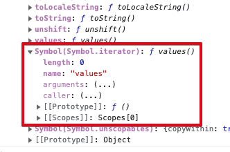

# 이터러블, 이터레이터

오늘 밤샘모니터링 때는 웹소켓 1만건 트래픽 처리 로직을 개발하는데에 full 로 시간을 썼다. 웹소켓 1만건의 종목데이터가 어느 정도인지 확인하기 위해, 직접 로컬에서 래빗엠큐 바이패스 큐의 로그를 찍어서 확인해보니 AMD같은 종목은 1초에 3000 ~ 5000 건 이상된다. 이런 종목이 단순 몇백개 정도가 아니다보니 오늘 좀 애좀 먹었다.<br>

어찌 어찌 해결은 됐는데, 내일 더 완벽하게 처리될 것 같다. 더 잘 해결하는 법은 Nginx + 다중화하는거다. 근데 아직은 초기 개발단이라 인스턴스 하나만 쓰는게 낫다. 초기 개발단계에서 괜히 주접 떨어봐야 나중에 고치기 어려워진다.<br>

초기 사용자 없을때 1:1~10 정도의 사용자 정도는 버틸수 있는 정도만 일단 만들어둬야지. <br>

오늘 정리할 내용은 이터러블, 이터레이터다. 이터러블,이터레이터는 javascript 뿐만 아니라, java, c++ 등의 언어에 모두 존재한다. 물론 용어는 조금 다를 수도 있을것 같다. 보통 이터레이터 패턴이라는 디자인 패턴에서 파생된 개념을 각 언어마다 내장 라이브러리에서 별도로 기본제공하는 것 같다.<br>

<b>

## 참고

반복기 및 생성기 (Iterators and Generators)<br>

https://developer.mozilla.org/ko/docs/Web/JavaScript/Guide/Iterators_and_Generators<br>

이터레이터 프로토콜 (iterator protocol)<br>

https://developer.mozilla.org/en-US/docs/Web/JavaScript/Reference/Iteration_protocols#the_iterator_protocol<br>

이터러블 프로토콜 (iterable protocol)<br>

https://developer.mozilla.org/en-US/docs/Web/JavaScript/Reference/Iteration_protocols#the_iterable_protocol<br>

자바스크립트에서의 반복/순회에는 두가지 프로토콜이 있다. 이터러블 프로토콜, 이터레이터 프로토콜 이렇게 두개의 프로토콜을 가지고 있다.<br>

<br>

## 이터러블 (Iterable)

= 일반적으로 어떤 요소들을 순회 구문을 통해 쉽게 탐색할 수 있는 자료구조<br>

= 이터러블 프로토콜을 지키는 객체를 이터러블 객체라고 이야기한다.<br>

= 즉, 이터러블 객체는 Symbol.iterator() 메서드를 가지고 있다.<br>

= 따라서 이터러블한 객체는 모두 이터레이터를 반환할 수 있다.<br>

= for ... of 구문을 사용하고자 할 때 사용한다.<br>

<br>

## for ... of 구문

ex 1)

```javascript
const fruits = ['사과', '바나나', '체리']
console.log(Symbol.iterator in fruits)

for(const fruit of fruits) console.log(fruit)
```

<br>

출력결과

```plain
true
사과
바나나
체리
```

<br>

위의 코드는 아래의 코드와 같은 의미를 갖는다.

ex2)

```javascript
for(let i=0; i<fruits.length; i++){
    console.log(fruits[i])
}
```

<br>

## 이터러블 프로토콜

= 이터러블이 되기 위한 규약<br>

= "Symbol.iterator() 메서드를 가진 객체는 이터러블 객체가 될 수 있다"<br>

<br>

## Symbol.iterator() 메서드

= 파라미터가 없는 메서드다.<br>

= iterator protocol 을 준수하는 객체를 리턴한다.<br>

 ( iterator protocol 을 준수하는 객체는 next() 라는 메서드를 가진 객체를 반환한다. )<br>

= 대표적으로 배열 객체의 경우 Symbol.iterator 객체를 가지고 있다.<br>

<br>

ex)<br>

let fruits = ['Apple', 'Banana', 'Cherry']<br>

fruits 객체를 브라우저에서 출력해본 결과를 캡처한 사진은 아래와 같다.<br>



## 이터레이터 프로토콜

= 이터레이터 프로토콜을 따르는 객체는 next() 메서드를 가지고 있다.<br>

= next() 메서드가 반환하는 객체는 value, done 프로퍼티를 가지고 있다.<br>

- next() 메서드의 리턴 객체 내 프로퍼티<br>

- - = done :<br>

  - - boolean 타입이다.<br>
    - false 일 경우 계속 탐색할 다음 요소가 있다는 의미<br>
    - true 일 경우 계속 탐색할 다음 요소가 없다는 의미<br>

  - = value :<br>

  - - iterator 에 의해 반환되는 Javascript Value다. <br>
    - done == true 일때에 반환될수 있다.<br>

자세한 예제는 [링크](https://developer.mozilla.org/en-US/docs/Web/JavaScript/Reference/Iteration_protocols#examples_using_the_iteration_protocols)를 참고<br>

ex)

```javascript
const fruit = ['Apple', 'Banana', 'Cherry']

const it = fruit[Symbol.iterator]()

console.log(it.next())
console.log(it.next())
console.log(it.next())
console.log(it.next())
```

<br>

출력결과<br>

```plain
{ value: 'Apple', done: false }
{ value: 'Banana', done: false }
{ value: 'Cherry', done: false }
{ value: undefined, done: true }
```

