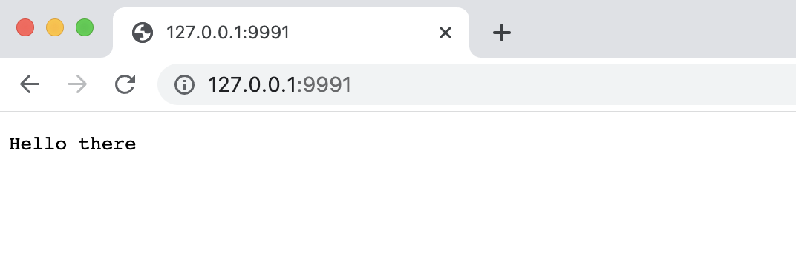
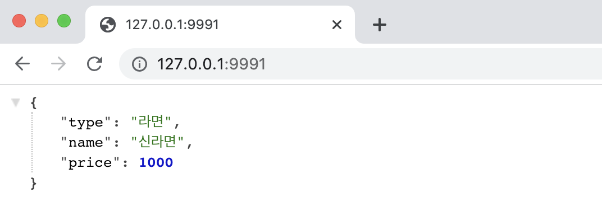

# 5. helloworld 서버 애플리케이션

간단한 http 서버를 먼저 만들어보자. <br>

클라이언트의 http 요청을 대기하고 있다가, 클라이언트의 요청이 오면 간단한 메시지를 보내는 역할을 하는 서버애플리케이션이다.<br>

<br>

## 참고자료

- nodejs.org/api/http.html
  - [http.createServer(req, resp) : Server](https://nodejs.org/api/http.html#httpcreateserveroptions-requestlistener)
- [실시간 모니터링 시스템을 만들며 정복하는 MEVN](https://ridibooks.com/books/3780000133)

<br>

## 간단한 http 서버 만들어보기 (1)

첫번째 예제는 아래와 같다.

**`helloworld-server-1.js`**<br>

```javascript
const http = require('http')
const SERVER_PORT = 9991

const server = http.createServer((req, res)=>{
    res.setHeader('Content-Type', 'text/plain; charset=utf-8')
    res.end('Hello there')
})

server.listen(SERVER_PORT, () =>{
    console.log(`Server Started Listening at a port ${SERVER_PORT}.`)
})
```

<br>

**서버 객체 생성/정의/response 정의**<br>

서버 객체를 생성하는 부분을 자세히 살펴보자.<br>

http라는 모듈에서 http 라는 객체를 변수 http 에 담았다. 이 http 객체는 Node.js 에서 기본으로 제공하는 내장(built in) 모듈이다. (npm 으로 따로 설치하지 않아도 사용할 수 있는 모듈이다.)<br>

```javascript
const server = http.createServer((req, res)=>{
    res.setHeader('Content-Type', 'text/plain; charset=utf-8')
    res.end('Hello there')
})
```

<br>

http 모듈에는 `createServer (req, res) : Server` 형태의 메서드가 존재한다. 이 `createServer(req, res) : Server`  는 request, response 를 처리할 수 있는 Server 라는 이름의 객체를 리턴한다. 즉, 위의 로직은 Server 타입의 객체를 생성하는 로직이다.(아직은 타입스크립트를 사용하는 것이 아니기에 Server 타입이라는 용어가 조금은 이상한 용어이긴 하지만.)<br>

<br>

이렇게 server 객체를 생성할 때 response 를 어떻게 실어서 보낼지를 결정할 수 있다. 위의 예제에서는 Content-Type 은 'text/plain'으로 지정했고, 인코딩은 charset=utf-8 을 지정했다. 그리고 클라이언트에게 전달할 문자열은 'Hello there'로 정의했다.<br>

<br>

**서버 리슨 로직 구현**<br>

위에서 사용한 서버 생성 로직은 단순히 메모리 상에 객체 하나를 생성해 변수에 할당해놓은 구문에 지나지 않는다.<br>

서버가 클라이언트의 요청을 받아들이기 위해서는 생성한 서버객체가 클라이언트의 요청을 받았을때 수행할 동작을 이벤트 리스너에 정의하면 된다. 아래의 로직은 이 내용을 담고 있다.

```javascript
server.listen(SERVER_PORT, () =>{
    console.log(`Server Started Listening at a port ${SERVER_PORT}.`)
})
```

<br>

**로컬 서버 구동 + 브라우저에서 접속해보기**<br>

> 로컬 서버 구동

로컬에서 서버를 구동하려면 아래의 명령어를 입력하면 된다. 나는 파일 명을 helloworld-server-1.js 라는 이름으로 만들었기에 아래의 명령어로 했다. 만들어놓은 파일명에 따라 다르게 아래의 명령어를 수행해야 한다.

```bash
$ node helloworld-server-1.js
```

<br>

> 브라우저에서 접속해보기

이렇게 구동시킨 서버는 브라우저에서 아래와 같이 http://127.0.0.1/9991 을 주소창에 입력해 접속하면 아래 캡처와 같은 결과가 나타난다.



<br>

## 간단한 http 서버 만들어보기 (2) - JSON 응답 서버

위에서  `createServer (req, res) : Server`  메서드를 어떻게 만드는지 정리를 이미 했기에, 자세한 설명은 생략하고, JSON형식으로 응답하는 서버는 어떤 방식으로 작성하는지 예제를 살펴보자.<br>

> json은 항상 상대편에 보낼때는 Serialization 을 해줘야 한다. 스프링에서는 우리가 이런 동작을 작성하지 않는데, 내부적으로 요청/응답 시마다 뷰 리졸버를 기본옵션 빌트인 리졸버로 JSON뷰리졸버를 사용하고 있기에 JSON 직렬화/역직렬화를 해준다.<br>

```javascript
const http = require('http')
const SERVER_PORT = 9991

const server = http.createServer((req, res) => {
    res.setHeader('Content-Type', 'application/json; charset=utf-8')
    
    const food = {
        'type' : '라면',
        'name' : '신라면',
        'price' : 1000
    }

    res.end(JSON.stringify(food))
})

server.listen(SERVER_PORT, ()=>{
    console.log(`Server is now listening on port ${SERVER_PORT}.`)
})
```

<br>

출력결과는 아래와 같다.<br>



<br>